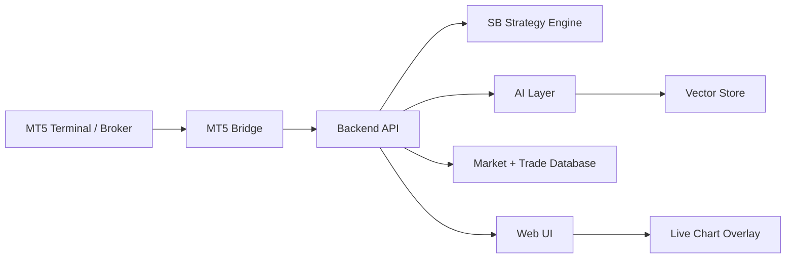

# SB System - Project Instructions

## Project Vision

SB System is a Forex trading research and signal platform based on Stacey Burke trading concepts.

The first goal is to build a reliable signal and research system. Auto-trading is intentionally out of scope until the strategy rules, examples, backtesting, and paper-trading results are validated.

This project should stay testable, explainable, and evidence-driven. AI should help classify, compare, explain, and retrieve relevant historical examples. AI should not be the only source of trade decisions.

## Current Source Material

Strategy and example documents are stored under:

- `docs/strategy_note/`
- `docs/chart_template_notes/`

The PDF documents include Stacey Burke playbook notes, trade setup examples, session examples, opening range examples, inside day examples, first green day examples, first red day examples, pump and dump examples, parabolic examples, and other chart markup references.

Do not treat the PDFs as already-structured strategy rules. The first research task is to extract, normalize, and validate the concepts into a machine-readable strategy specification.

## Product Direction

Build SB System as a web application with a backend service and an MT5 bridge.

Preferred direction:

- Web UI usable from both Windows and macOS laptops.
- MT5 terminal can run on Windows or VPS.
- A bridge process connects MT5 data to the backend.
- Backend handles strategy logic, data storage, RAG, pattern search, and signal scoring.
- Web UI displays live charts, detected setups, overlays, similar examples, and confidence details.

Avoid building the first version as a Windows-only desktop app. That would make AI, RAG, visual search, testing, and cross-platform use harder.

## Core Principle

Separate the system into three layers:

1. Deterministic rule engine
2. AI-assisted explanation and comparison
3. Human decision workflow

The rule engine should generate setup candidates. AI should retrieve examples, compare similarity, and explain confidence. The user should confirm signals before any real trading.

## High-Level Architecture



## Main Components

### 1. MT5 Bridge

Responsible for getting live and historical market data from MetaTrader 5.

Possible implementations:

- Python process using the MetaTrader5 package.
- MQL5 Expert Advisor sending data to the backend through WebRequest or sockets.
- Hybrid approach: Python for research/backtesting, MQL5 EA for production signal/execution bridge.

Initial scope:

- Read symbols, candles, ticks, spread, and account metadata.
- Push normalized data to backend.
- Do not execute real trades in the first version.

### 2. Backend API

Suggested stack:

- Python
- FastAPI
- PostgreSQL for durable storage
- SQLite is acceptable for early prototype
- Optional TimescaleDB later for larger candle/tick history

Responsibilities:

- Receive market data from MT5 bridge.
- Store OHLCV/tick/session data.
- Run deterministic strategy detection.
- Serve signals and chart overlays to the UI.
- Manage pattern library metadata.
- Manage RAG and vector search.

### 3. SB Strategy Engine

This is the most important part of the system.

It should convert Stacey Burke concepts into explicit, testable rules. Each detected setup should include:

- Symbol
- Timeframe
- Session
- Setup type
- Price location
- Entry zone
- Stop area
- Target area
- Invalidation condition
- Rule match score
- Relevant historical examples
- Explanation

The strategy engine should be deterministic where possible. Do not hide core trade rules inside an LLM prompt.

### 4. Pattern Library

The existing chart example PDFs should become a searchable pattern library.

Each example should eventually have:

- Source PDF
- Page number
- Screenshot/image crop
- Symbol if known
- Timeframe if known
- Market session
- Setup type
- Direction
- Entry logic
- Stop logic
- Target logic
- Outcome if known
- Tags
- Notes

Suggested tags:

- first green day
- first red day
- pump and dump
- parabolic
- short squeeze
- inside day
- opening range
- three sessions
- breakout trader
- HOD/LOD
- major news first bounce
- low hanging fruit

### 5. RAG Pipeline

RAG should support explanation and evidence retrieval.

Pipeline:

1. Extract text and images from PDFs.
2. Split content by concept, setup, page, and example.
3. Store text chunks with metadata.
4. Store chart image embeddings separately from text embeddings where possible.
5. Retrieve relevant notes and examples for each detected setup.
6. Show citations back to the source PDF/page.

RAG output should answer:

- Which Stacey Burke concept does this setup resemble?
- Which historical examples are closest?
- What evidence supports the signal?
- What evidence weakens the signal?
- What should invalidate the setup?

### 6. Computer Vision

Computer vision is useful for chart screenshot comparison and example retrieval, but it should not replace OHLC/time/session logic.

Recommended use:

- Extract chart regions from PDFs.
- Compare current chart image to historical examples.
- Rank visually similar examples.
- Detect approximate shapes such as W/M patterns, parabolic moves, opening range behavior, or HOD/LOD sweeps.

Risk:

- Chart images can vary by theme, zoom level, broker candle shape, indicators, and annotations.
- Prefer structured candle data for live rule detection.

### 7. Web UI

The web UI should be the main operator interface.

Important views:

- Live chart with SB overlays
- Active signal list
- Signal detail panel
- Similar historical examples
- RAG explanation with source references
- Pattern library browser
- Backtest/replay view
- Trade journal
- Settings for symbols, sessions, risk, and confidence thresholds

Chart overlay should support:

- Session boxes
- HOD/LOD marks
- Opening range
- Entry zone
- Stop zone
- Target zone
- Pattern labels
- Confidence breakdown

Current Phase 1 overlay implementation:

- Backend endpoint: `GET /context/overlays`
- First context levels: previous day high/low, previous week high/low, latest Friday close, current Monday high/low as solid right-extending rays from their relevant start time
- First intraday range layer: previous-day high and low are drawn as two connected step pipes, high-to-high and low-to-low, across day periods
- First day layer: custom chart day-period bands with centered weekday labels; avoid relying on the chart library's default grid
- First month layer: vertical month separators across the chart
- First intraday close layer: previous-day-close is drawn as a horizontal segment that spans only the current day period
- First session layer: Asia 03:00-06:00, London 09:00-12:00, and New York 15:00-18:00 boxes using chart/data time
- Intraday day/session templates are hidden on H4 and D1 charts
- Default visible chart view is 7 days for M1/M5/M15/M30/H1 and 30 days for H4/D1; do not restrict the loaded candle history for this behavior
- First labels: weekday labels plus v0 Inside Day, FGD, FRD, 3DL, and 3DS daily setup labels
- These labels are deterministic placeholders and must be validated/refined against the Stacey Burke PDFs before they are treated as trading signals.

## Signal Confidence Model

Avoid one vague AI confidence score.

Use a transparent score made from multiple components:

- Rule match strength
- Session/time validity
- Location quality
- Market structure quality
- Pattern similarity
- Historical example similarity
- Spread/liquidity condition
- RAG evidence strength
- AI uncertainty or contradiction notes

Example structure:

```json
{
  "symbol": "EURUSD",
  "timeframe": "M15",
  "setup_type": "pump_and_dump",
  "direction": "short",
  "confidence": 0.78,
  "components": {
    "rule_match": 0.85,
    "session_validity": 0.9,
    "location_quality": 0.75,
    "pattern_similarity": 0.72,
    "rag_evidence": 0.8,
    "spread_condition": 0.7
  }
}
```

## Development Phases

### Phase 1 - Strategy Research and Rule Specification

Goal: turn PDFs and examples into a structured SB strategy specification.

Deliverables:

- Setup taxonomy
- Rule definitions
- Session definitions
- Pattern tags
- Invalidation rules
- Data requirements
- Initial scoring model

### Phase 2 - Document and Example Index

Goal: make source material searchable.

Deliverables:

- PDF inventory
- Extracted text
- Extracted chart images
- Metadata per PDF/page/example
- Initial vector index
- Simple retrieval script/API

### Phase 3 - Market Data Foundation

Goal: connect MT5 and store normalized market data.

Deliverables:

- MT5 bridge prototype
- Candle/tick schema
- Symbol/session configuration
- Historical import
- Data quality checks

### Phase 4 - Rule-Based Signal Engine

Goal: detect candidate setups using explicit rules.

Deliverables:

- Setup detectors
- Signal objects
- Confidence components
- Unit tests with sample data
- Backtest/replay support

### Phase 5 - Web UI Signal Dashboard

Goal: show signals clearly.

Deliverables:

- Live chart
- Overlay drawing
- Signal panel
- Similar examples panel
- Explanation panel
- Pattern library view

### Phase 6 - RAG and Visual Similarity

Goal: connect signals to source material and historical examples.

Deliverables:

- RAG search API
- PDF/page citations
- Similar example ranking
- Chart image similarity
- Confidence explanation

### Phase 7 - Paper Trading and Validation

Goal: validate the system without real execution.

Deliverables:

- Paper trade tracking
- Signal outcome tracking
- Trade journal
- Performance reports
- False positive analysis

### Phase 8 - Optional Auto-Trading

Only consider this after enough validation.

Requirements before auto-trading:

- Stable signal engine
- Clear risk management
- Backtest results
- Forward paper-trading results
- Broker execution testing
- Fail-safe controls
- Manual override
- Full logging

## Suggested Technology Stack

Initial prototype:

- Backend: Python + FastAPI
- Database: SQLite first, PostgreSQL later
- Vector search: local vector DB first, upgrade later if needed
- Frontend: React or Next.js
- Charting: Lightweight Charts, TradingView library if available/licensed, or another robust financial chart component
- MT5 bridge: Python MetaTrader5 package or MQL5 EA

Keep the first version simple. Prefer working signal detection and review flow over complex infrastructure.

## Data Model Concepts

Core entities:

- Symbol
- Candle
- Tick
- Session
- SetupPattern
- Signal
- SignalScore
- PatternExample
- SourceDocument
- DocumentChunk
- ChartImage
- TradeJournalEntry
- BacktestRun

## Early Engineering Rules

- Do not build auto-trading first.
- Do not make the LLM the trading engine.
- Do not hardcode broker-specific assumptions without config.
- Do not skip source metadata when extracting from PDFs.
- Do not lose page numbers, file names, or chart-example references.
- Do not optimize infrastructure before the rules are clear.
- Build small verifiable modules.
- Keep all strategy rules auditable.
- Every signal should explain why it exists and what would invalidate it.

## GitHub Workflow

For implementation tasks, finish with a GitHub-ready change set:

- Create a feature branch before editing files.
- Keep notebook execution output out of commits unless it is intentionally part of the deliverable.
- Commit only files related to the task.
- Push the branch to GitHub.
- Open a pull request into `main`.
- Include a short summary, verification notes, and any known limitations in the PR description.

## Open Questions To Resolve

- Which Forex pairs should be supported first?
- Which timeframes matter most for the SB strategy?
- Which sessions should be modeled first: Asia, London, New York, rollover?
- Which setup types are highest priority?
- Should examples be manually tagged first or auto-tagged with review?
- Will MT5 run locally on Windows, on a VPS, or both?
- Should the first UI be local-only or hosted on a private server?

## First Implementation Target

The first useful milestone should be:

"Given historical candles and a small manually tagged pattern library, SB System detects candidate setup zones on a chart and shows similar historical examples with an explanation."

This milestone avoids premature auto-trading and creates the foundation for testing the strategy properly.
